# Mosquitto Setup in Ubuntu Server 20.04 on a VM

## Description
This is a Proof of Concept of a way to monitor the users being active on a Ubuntu Server through rsyslog, mosquitto and a flask app.

## Step 1
### Getting an Ubuntu Server image
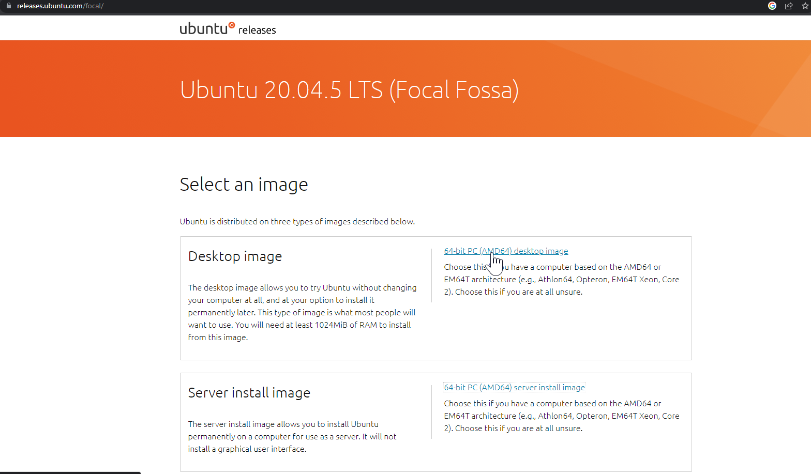

## Step 2
### Setting up a VM in Hyper-V windows.


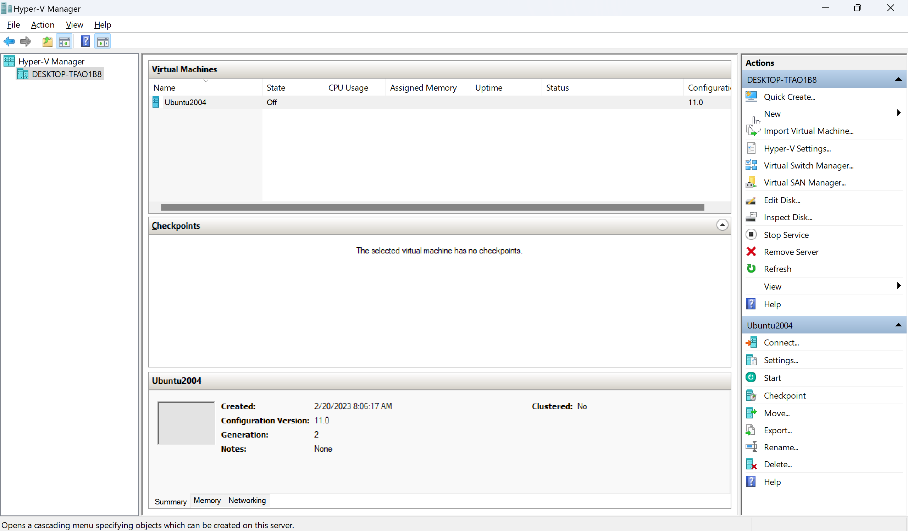

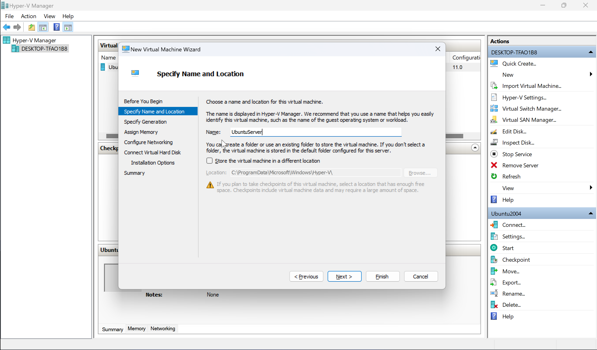
And follow the wizard to create your VM, during the wizards steps you will be asked to select the ubuntu server image that you downloaded.

After finishing the wizard step you will see your server created as below.
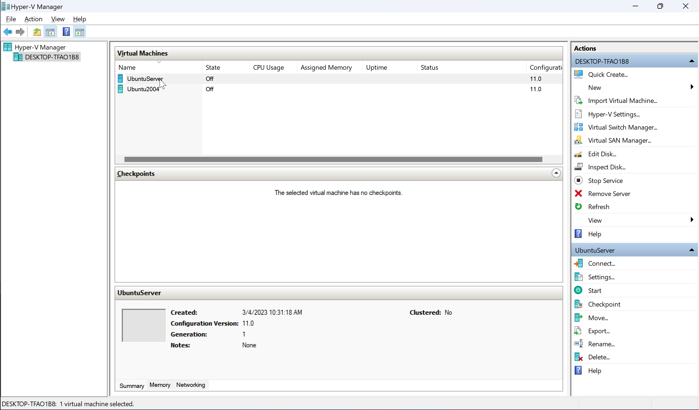

Right click on the server you created and Start the VM. You will be prompted with the image below.
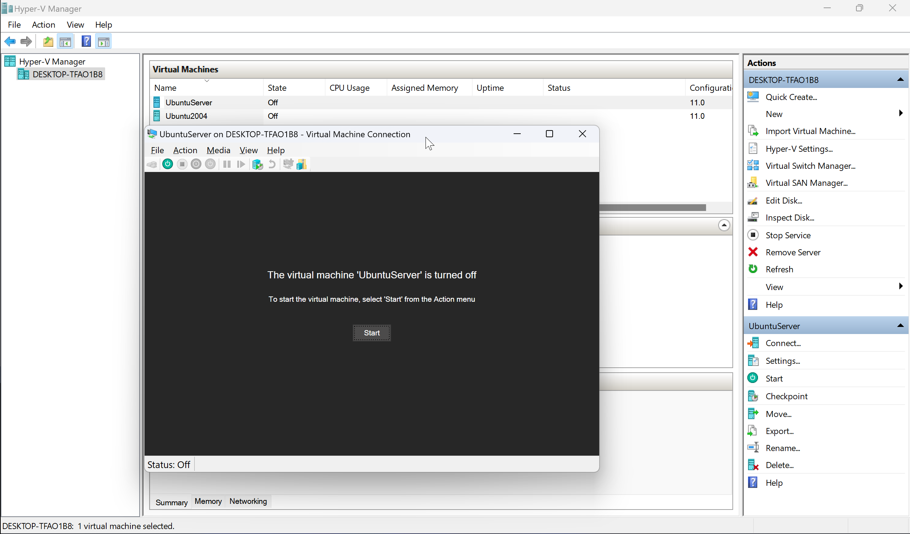

## Step 3
### Setting up Ubuntu Server in the VM

Following the start of the server in the VM you will be asked to begin setting the server up.

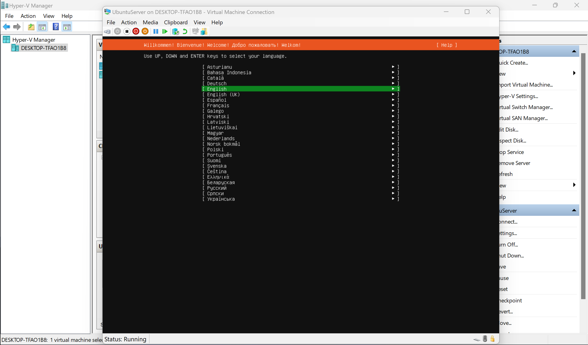

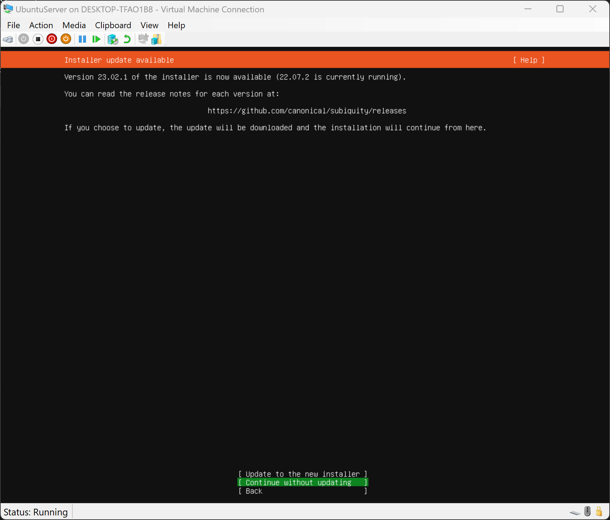

Don't change anything up until the User setup sreen(shown below).

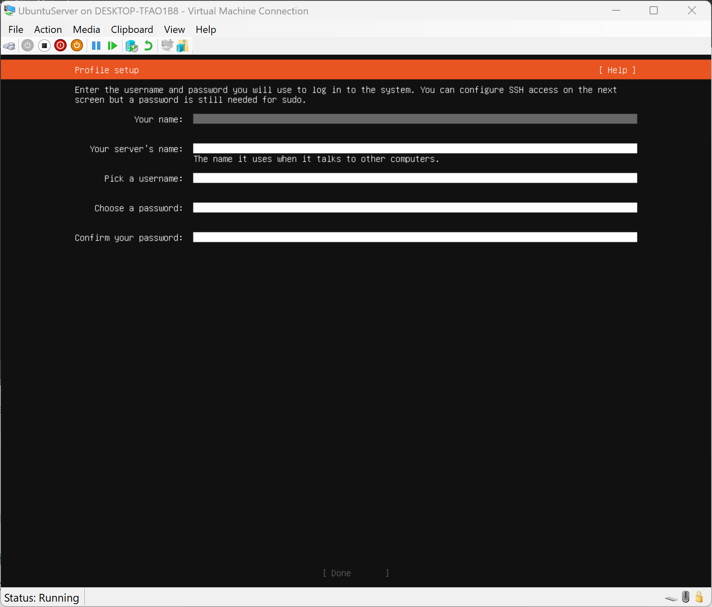

Then you would need to enable openSSH.

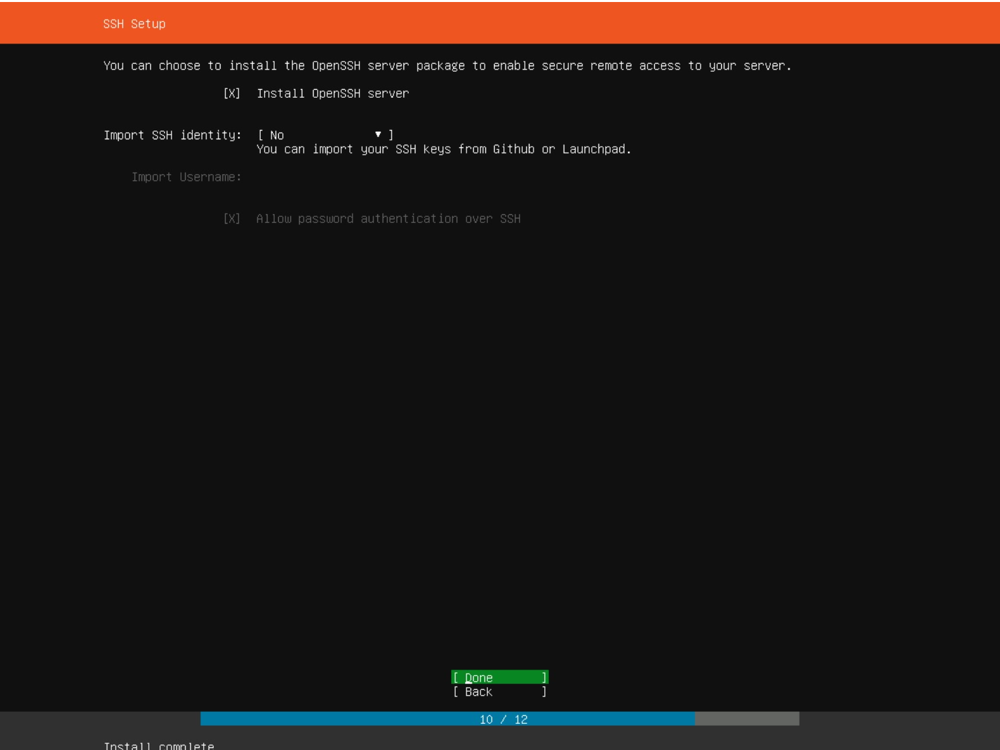

In our case we don't need any of the packagges provided on next screen.
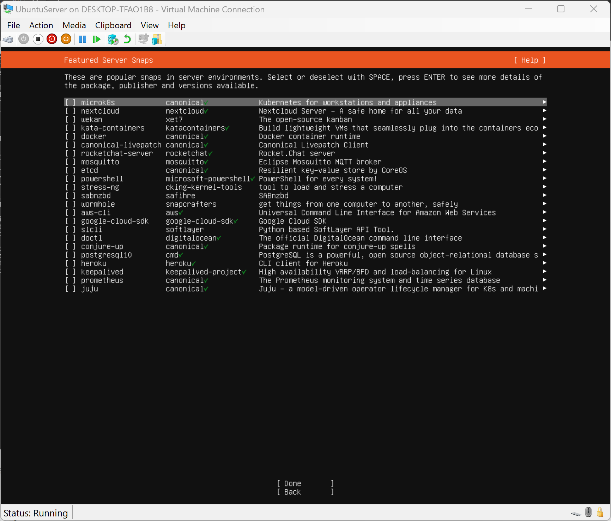

Then proceed with the installation.

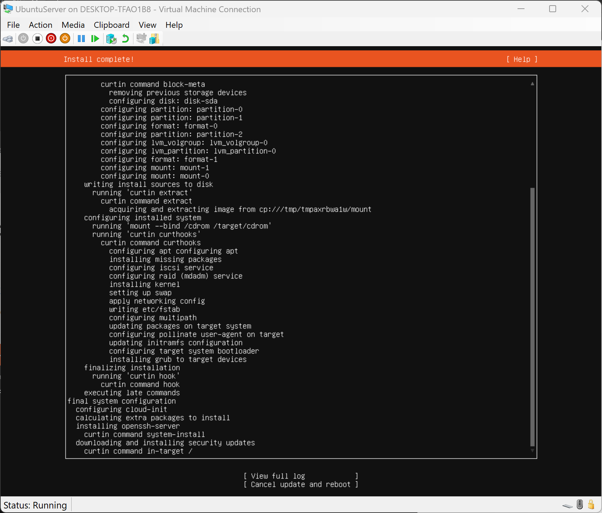

At the end of the installation you would need to reboot.

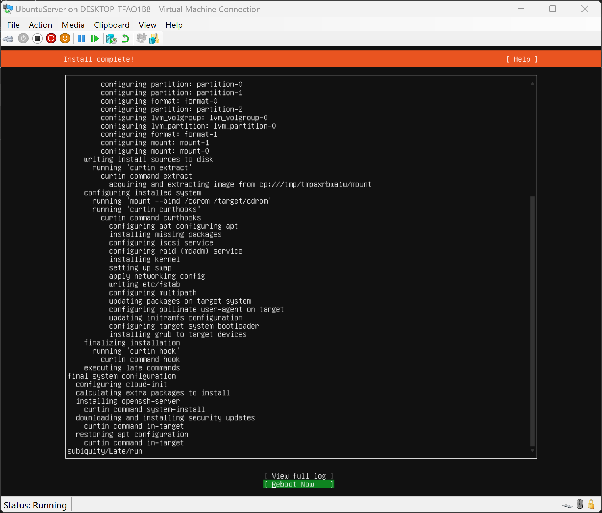

Aftewards after the reboot is done you can proceed with logging into the server with the user you created using the credentials you provided.

Finally you you need to:
```sh
sudo apt update
```
in order to update the packages of the server and then:
```sh
sudo apt upgrade
```
in order to upgrade them to the latest version supported in Ubuntu 20.04 Server.

## Step 4
### Setting up mosquitto for the MQQT functionality

```sh
sudo apt install mosquitto mosquitto-clients
```
then:
```sh
sudo nano /etc/mosquitto/conf.d/default.conf
```
and write 
```
listener 1883 localhost
```
at the beggining of the file, save the file and exit back to the terminal, afterwards execute:
```sh
sudo systemctl restart mosquitto
```
in the terminal.

## Step 5 
### Create a script to track logged in users in /usr/local/bin and publish them with mosquitto.
Go to the directory.
```sh
cd /usr/local/bin
```
Open a nano editor with the script name.
```sh
sudo nano loginTrack.sh
```
Place the code below in the script:
```sh
#!/bin/bash
timestamp=$(date "+%Y-%m-%d %H:%M:%S")
readarray -t ar < <(who)
usernamesString=""
for i in "$ar[@]"
do
username=$(echo $i | awk '{print $1}')
usernamesString+="$username, "
usernamesString+="mid, "
done
usernamesString=${usernamesString%,*}
mosquitto_pub -t "users" -m "$timestamp $usernamesString"
```
and change its privilegies to executable:
```sh
sudo chmod 777 loginTrack.sh
```
## Step 6
### Trigger the script from events in rsyslog.
Execute:
```sh
sudo nano /etc/rsyslog.conf
```
Edit /etc/rsyslog.conf with the following lines in the end of the file:
```
 module(load="omprog")
 if $msg contains "new session" and $programname startswith "systemd-logind" then {
         action(type="omprog" binary="/bin/bash /usr/local/bin/loginTrack.sh opened" )
 }
 if $msg contains "removed session" and $programname startswith "systemd-logind" then {
         action(type="omprog" binary="/bin/bash /usr/local/bin/loginTrack.sh closed" )
 }
```

 This will use the omprog module in order to monitor the login and logout events in the server and when those events occur it will trigger our loginTrack.sh script.

 Afterwards you would need to restart the rsyslog service:
 ```sh
 sudo systemctl restart rsyslog
 ```
## Step 7
### Create the python flask app that listens to mosquitto server.

Go to your home directory.
```sh
cd /home
```
 Make sure you have python 3 installed in your server:

 ```sh
 python3 -V
 ```

 If you don't then install it:
 ``` 
sudo apt install python3
```
Create a directory for the flask app:
```sh
mkdir mqttFlask
```
and go into it.

```sh
cd mqttFlask
```
Install pip for python:
```sh
sudo apt install python3-pip
```
Install pip for python:
```sh
sudo apt install python3-venv
```
and create a virtual env:
```sh
python3 -m venv env
```
using **ls** you will see a directory name env, you can activate it using:
```sh
source env/bin/activate
```

Now you can you install the required packages:
```sh
pip install flask
pip install flask_socketio
pip install flask_mqtt
```
Following that we can create your flask app:

```sh
nano app.py
```
and in that file place the code below.
```py
from flask import Flask, jsonify
from flask_mqtt import Mqtt
from flask_socketio import SocketIO

app = Flask(__name__)
app.config['MQTT_BROKER_URL'] = 'localhost'
app.config['MQTT_BROKER_PORT'] = 1883
app.config['MQTT_USERNAME'] = ''
app.config['MQTT_PASSWORD'] = ''
app.config['MQTT_REFRESH_TIME'] = 1.0 

mqtt = Mqtt(app)
mqtt_topic = "users"
messages = []
@app.route('/')
def index():
    return jsonify(messages)

@mqtt.on_connect()
def handle_connect(client, userdata, flags, rc):
    if rc == 0 :
        print("Connected to Mqtt broker")
    else:
        print("Failed to connect")


@mqtt.on_message()
def handle_mqtt_message(client, userdata, message):
    messages.append(message.payload.decode("utf-8"))

if __name__ == '__main__':
    mqtt.subscribe(mqtt_topic)

    mqtt.client.loop_start()

    app.run(debug=True)
```

Finally you can run the app using python3 app.py

## Finally
This would result in a web server serving at localhost that can be later be exposed through a reverse proxy online if the VM has public internet access or directly exposing it's port.

Remember that if your firewall is active you would need to modify it approprietly in order to be able to access the vm from a specific port.

The webserver would store the users in-memory and show them when someone visits the public IP/domain of the server.

If you shutdown or restart the vm you would need ot restart the flask app, in order ot avoid that you could create a service that does it automatically.
